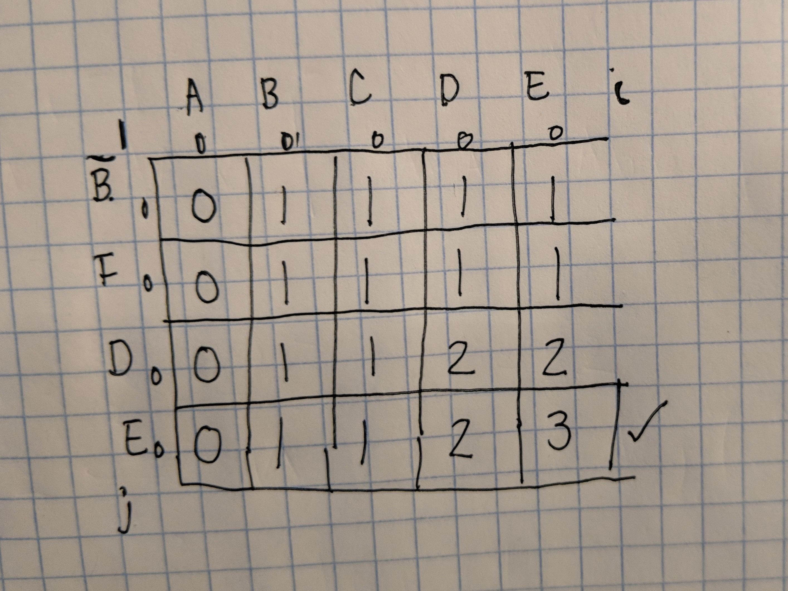

# The Longest Common Subsequence

This is a classical problem in algorithms! Actually I think I remember doing some
kind of implementation for my BMI 214 class. Those were fun times :)

The [longest common subsequence](https://en.wikipedia.org/wiki/Longest_common_subsequence_problem)
problem asks us to:

>  the problem of finding the longest subsequence common to all sequences in a set of sequences (often just two sequences).

Oh my gosh, and I just realized this is the bread and butter of something like [diff](http://man7.org/linux/man-pages/man1/diff.1.html) or version control (Github!). Since I also took BMI 214, I think this is going to be a flavor of dynamic programming.

Let's start with two sequences.

```
A='ACDBADE'
B='BNGADEFG'
```

I'm going to start thinking about this as simply as I can. Looking at the strings, 
I see that I should be able to determine that the longest common subsequence
(let's abbreviate this as LCS) is `ADE`. My first effort was the following:

```
longest = ''
index=0
for a in range(len(A)):
    for b in range(len(B)):
        # The last index in B that was accounted for in A
        if b >= index:
            # Case 1: same character
            if A[a] == B[b]:
                longest+= A[a]
                index = b
                break
```

Which yielded an answer of `ADDE` - the problem here is that while we see two D's in A,
we only see one D in B. We can fix that by, instead of going from a range of 0 to B,
We instead go from index to B:

```
longest = ''
index=0
for a in range(len(A)):
    for b in range(index, len(B)):
        # The last index in B that was accounted for in A
        if b > index:
            if A[a] == B[b]:
                print("Adding %s: index is %s" %(A[a], index))
                longest+= A[a]
                index = b
                break
```

Since we could always add one more character to the string, and we are looping through
A and B, this would be O(logN^2), which is pretty bad. I was quasi satisfied that this
method provided (some inefficient) solution at first, but there is a terrible flaw. 
The flaw is that it's a greedy solution that wouldn't be able to drop a match once 
started. This example illustrates that point nicely:

```
A="abaab"
B="aab"
```

We actually want `aab` and to scrap the first `ab`. If we use the above equation,
it's greedy (gets the first local maximum) we get `ab`. We technically would have needed
to go through the same procedure starting with `a`, and then `b`, and only when we started
with the third `a` in A would we have stumbled on `aab`. That would still increase exponentially
the search space, and it's not a good solution.

We do in fact need something that is more akin to dynamic programming that uses a matrix. 
Let's define a Lookup Table, L, which is a table of size len(A) (N) by len(B) (B)
and where each cell L[A,B] will first hold the **length** of the longest common substring given that
we start at character a (iterator through A) and b (iterator through B). To help understand this, I
drew a table and talked myself through it. I couldn't do this in markdown, it was too hard!



Here is how I thought about this.

 1. We want to find the longest subsequence common between the two strings, meaning that we maintain order, and we are allowed to have insertions (or deletions) in one string or the other.
 2. We will consider some subset of the top row (string A) always against some subset of the second string (the column). The coordinate i is used to indicate **up to** a position in A, and j is used to indicate up to a position in B.
 3. Since the edges represent an empty string, this is akin to comparing an empty string to something, or to another empty string, and the result is an empty string. In our table we count this as 0 because there are no common characters.
 4. For each coordinate i, j, I consider A from 1 to i, and first look at if A[i] == B[j].
   a. If they are equal, this means we have a common character! We off the bat can add one to the cell.
   b. If they aren't equal, we don't add an extra to the cell.
   c. But what are we adding to? A non zero value in the diagonal back and up (Table[i-1, j-1] means that the last character we hit was also a match). A left (Table[i-1, j]) or up (Table[i, j-1]) means that there was some match between the strings, just not at the same previous coordinate. Which do we choose? Since we want to maximize the length of the substring, we can easily choose the number that is largest (call it N), because it indicates there were N characters matching at that index.
 5. We can then work our way from the top left to the bottom right until we fill the entire table!
 6. The answer, the length of the longest common substring, is the number in the cell at the bottom right.

```

L=numpy.zeros(shape=(len(A),len(B)))
for a in range(0, len(A)):
    for b in range(0, len(B)):

        left = 0
        if a >= 1:
            left = L[a-1, b]

        up = 0
        if b >=1:
            up = L[a, b-1]
        
        diag = 0
        if a >=1 and b >=1:
            diag = L[a-1,b-1]

        # if they aren't the same, the current longest for the coordinate is
        # whichever of the last overlap was bigger
        if A[a] != B[b]:
            L[a,b] = max(left, up)

        # If they are the same, we add 1 to continued last longest
        else:
            L[a,b] = diag +1
```

This gives us a matrix like this:

```python

L
array([[ 1.,  1.,  1.],
       [ 1.,  1.,  2.],
       [ 1.,  2.,  2.],
       [ 1.,  2.,  2.],
       [ 1.,  2.,  3.]])
```

In retrospect I could have made the matrix one bigger in each dimension to allow for
indexing the negative one value (e.g., L[a-1,b] when a==0 would have been put in the first
spot) but this works. If we look at L[4,2] (the max coordinate of our i and j, and the bottom right)
we can easily see the length of the maximum common subsequence is 3. But this would
be hard to use and go back to translate to letters, right? So I decided to try the
same strategy, but instead of storing the length in the cell, storing the actual longest
sequence for the coordinate. Here I am also being more creative with data structures
because (off the top of my head) I don't remember what numpy calls it's cell array.
I'll just use the len() of each string in the list for length.


```python

L=[['']*len(B) for a in range(len(A))]
for a in range(0, len(A)):
    for b in range(0, len(B)):

        left = ''
        if a >= 1:
            left = L[a-1][b]

        up = ''
        if b >=1:
            up = L[a][b-1]
        
        diag = ''
        if a >=1 and b >=1:
            diag = L[a-1][b-1]

        # if they are the same, add the letter there to previous
        if A[a] == B[b]:
            L[a][b] = "%s%s" %(diag, A[a])
        else:
            L[a][b] = max([left, up], key=len)
```
The matrix now looks like this:

```python
[['a', 'a', 'a'],
 ['a', 'a', 'ab'],
 ['a', 'aa', 'ab'],
 ['a', 'aa', 'ab'],
 ['a', 'aa', 'aab']]
```

And if I wanted to remember the longest, I could just add a variable to do that.

```python

def lcs(A,B):
    '''return the longest common substring (lcs) between two strings, A and B.
    '''
    L=[['']*len(B) for a in range(len(A))]
    for a in range(0, len(A)):
        for b in range(0, len(B)):

            left = ''
            if a > 0:
                left = L[a-1][b]

            up = ''
            if b > 0:
                up = L[a][b-1]
        
            diag = ''
            if a > 0 and b > 0:
                diag = L[a-1][b-1]

            # if they are the same, add the letter there to previous
            if A[a] == B[b]:
                L[a][b] = "%s%s" %(diag, A[a])
            else:
                L[a][b] = max([left, up], key=len)
            

    return L[a][b]

```
```python

lcs(A,B)
'aab'
```

The complexity of this is O(N^2) because in the worst case we have to go through the
entire of A and the entire of B to derive the matrix.
